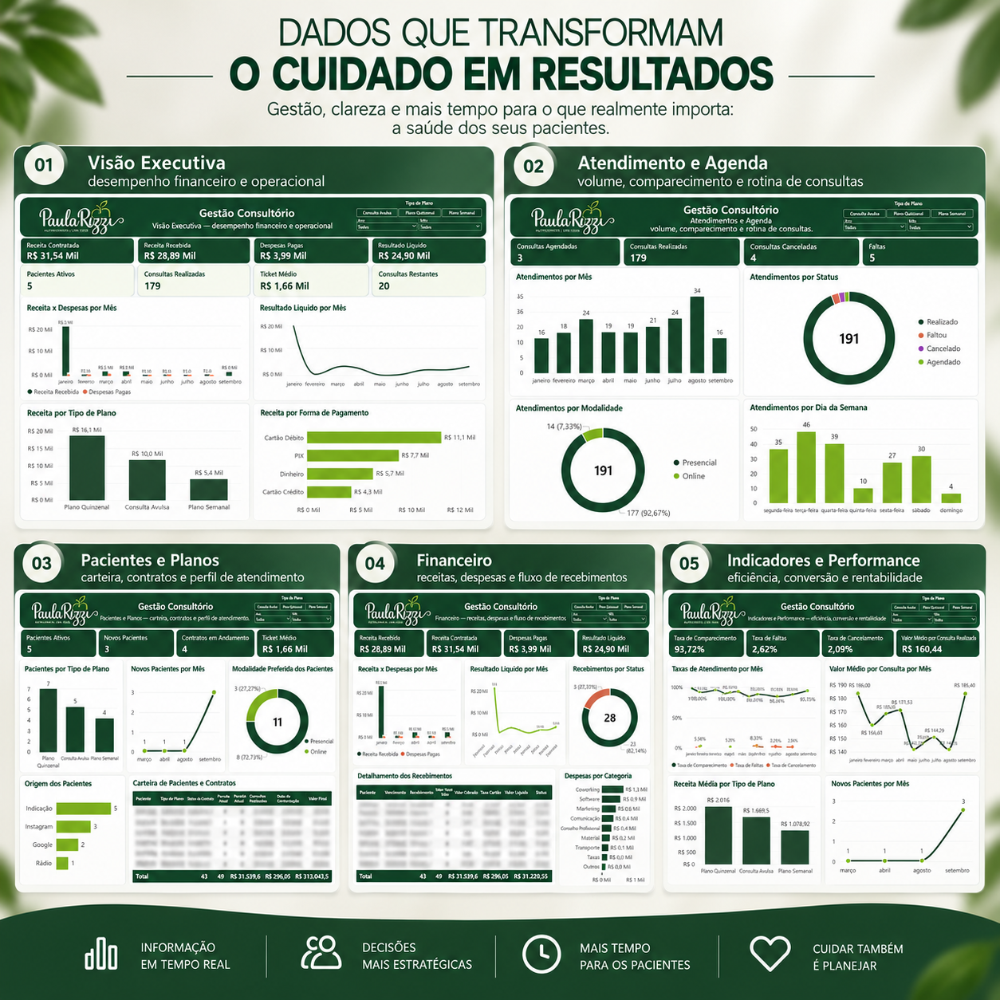
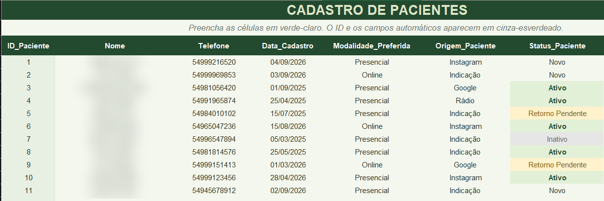
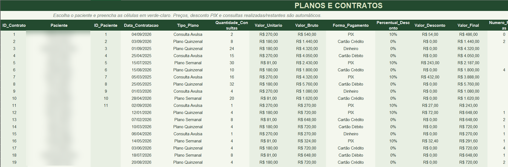
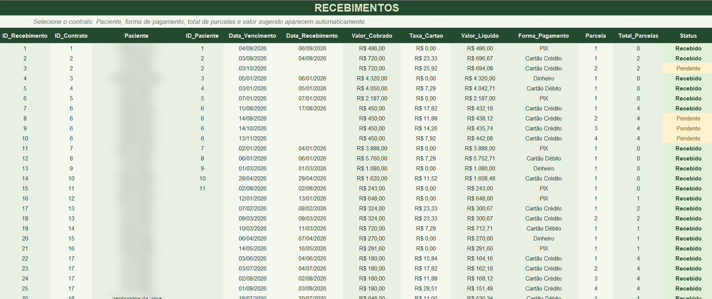
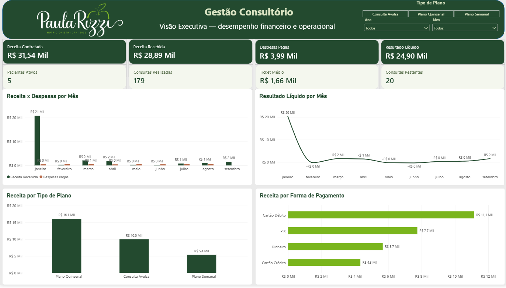
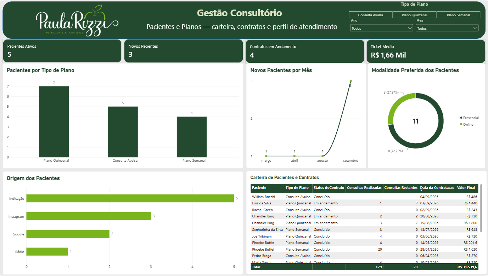
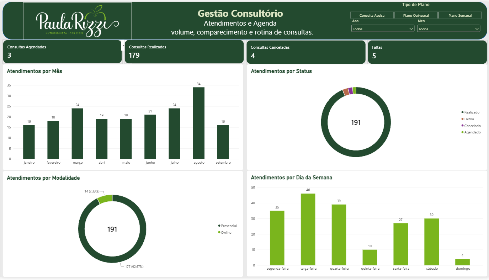
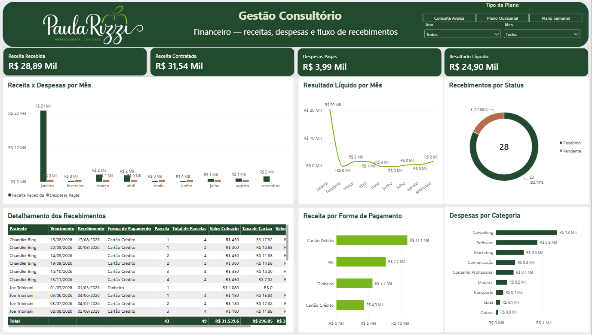
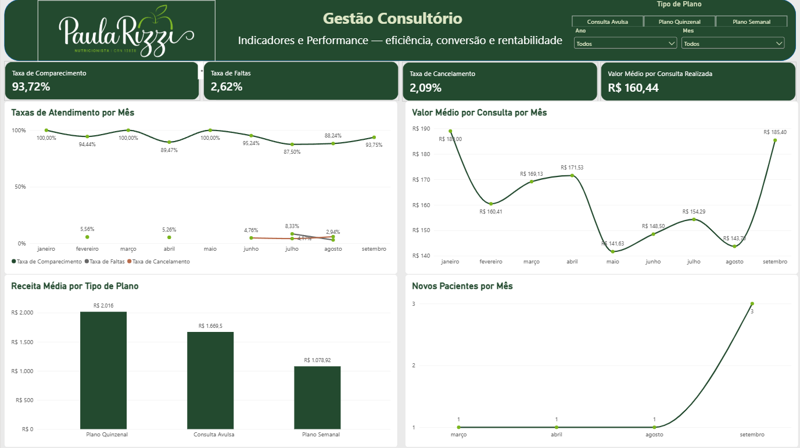

Gestão de Consultório — Excel + Power BI
Solução integrada de gestão desenvolvida para um consultório de nutrição, combinando Excel para registro e organização dos dados com Power BI para análise, acompanhamento de indicadores e apoio à tomada de decisão.

---
Sobre o projeto
A cliente precisava de uma forma simples e organizada de registrar e acompanhar tudo o que acontece no consultório, além de ter mais clareza sobre os principais indicadores financeiros, operacionais e de atendimento.
O projeto foi desenvolvido em duas etapas:
Excel — estruturação da base de dados e dos controles operacionais.
Power BI — modelagem, criação de medidas e desenvolvimento dos dashboards gerenciais.
O objetivo foi transformar registros do dia a dia em informações úteis para a gestão do consultório.
---
O problema
Antes da solução, as informações necessárias para acompanhar o negócio não estavam centralizadas em uma estrutura preparada para análise.
A necessidade envolvia acompanhar, entre outros pontos:
pacientes e origem dos atendimentos;
planos e contratos;
consultas realizadas, agendadas, canceladas e faltas;
recebimentos e formas de pagamento;
despesas do consultório;
desempenho financeiro;
indicadores de eficiência e performance.
---
A solução
Foi criada uma solução integrada em que o Excel funciona como base operacional e o Power BI como camada analítica.
Fluxo da solução
```text
Registro dos dados
      ↓
     Excel
      ↓
Organização e estruturação
      ↓
 Power Query / Modelo de Dados
      ↓
       DAX
      ↓
    Power BI
      ↓
Indicadores e tomada de decisão
```
---
Excel — Gestão operacional
A planilha foi criada para centralizar os registros do consultório de forma estruturada e facilitar a atualização dos dados.
Entre os módulos desenvolvidos estão:
cadastro de pacientes;
planos e contratos;
atendimentos;
recebimentos;
despesas;
parâmetros e configurações;
painel de acompanhamento.
Cadastro de Pacientes
Permite registrar informações essenciais para acompanhamento da carteira de pacientes, como modalidade preferida, origem e status.

Planos e Contratos
Controle dos planos contratados, valores, descontos, forma de pagamento, número de parcelas e acompanhamento das consultas realizadas e restantes.

Recebimentos
Controle financeiro dos recebimentos, incluindo vencimentos, valores cobrados, taxas de cartão, valores líquidos, parcelas e status.

A versão demonstrativa da planilha está disponível em:
`excel/gestao_consultorio_demo.xlsx`
---
Power BI — Dashboard Gerencial
A base estruturada no Excel foi conectada ao Power BI para criação de uma visão gerencial completa do consultório.
O dashboard foi dividido em cinco páginas, cada uma com um objetivo específico.
---
1. Visão Executiva
Resumo dos principais indicadores financeiros e operacionais do consultório.
Principais análises:
receita contratada;
receita recebida;
despesas pagas;
resultado líquido;
pacientes ativos;
consultas realizadas;
ticket médio;
consultas restantes;
receita x despesas por mês;
resultado líquido por mês;
receita por tipo de plano;
receita por forma de pagamento.

---
2. Pacientes e Planos
Visão voltada à carteira de pacientes, contratos e perfil de atendimento.
Principais análises:
pacientes ativos;
novos pacientes;
contratos em andamento;
ticket médio;
pacientes por tipo de plano;
novos pacientes por mês;
modalidade preferida;
origem dos pacientes;
carteira de pacientes e contratos.

---
3. Atendimento e Agenda
Página dedicada à rotina de consultas e eficiência operacional.
Principais análises:
consultas agendadas;
consultas realizadas;
consultas canceladas;
faltas;
atendimentos por mês;
atendimentos por status;
atendimentos por modalidade;
atendimentos por dia da semana.

---
4. Financeiro
Visão detalhada do fluxo financeiro do consultório.
Principais análises:
receita recebida;
receita contratada;
despesas pagas;
resultado líquido;
receita x despesas por mês;
resultado líquido por mês;
recebimentos por status;
receita por forma de pagamento;
despesas por categoria;
detalhamento dos recebimentos.

---
5. Indicadores e Performance
Página criada para acompanhar eficiência, conversão e desempenho do consultório.
Principais indicadores:
taxa de comparecimento;
taxa de faltas;
taxa de cancelamento;
valor médio por consulta realizada;
taxas de atendimento por mês;
valor médio por consulta por mês;
receita média por tipo de plano;
novos pacientes por mês.

---
Tecnologias utilizadas
Microsoft Excel
Power Query
Power BI
DAX
Modelagem de dados
Tratamento e transformação de dados
Data Visualization
Business Intelligence
---
Modelagem e lógica analítica
O modelo foi estruturado utilizando tabelas relacionadas para pacientes, contratos, atendimentos, recebimentos e despesas, além de uma tabela calendário para análises temporais.
Entre as medidas desenvolvidas estão:
Receita Contratada;
Receita Recebida;
Despesas Pagas;
Resultado Líquido;
Pacientes Ativos;
Novos Pacientes;
Consultas Realizadas;
Consultas Restantes;
Ticket Médio;
Taxa de Comparecimento;
Taxa de Faltas;
Taxa de Cancelamento;
Valor Médio por Consulta Realizada.
Também foram utilizados relacionamentos ativos e inativos no modelo, além de medidas DAX com `USERELATIONSHIP` para análises baseadas em diferentes campos de data.
---
Estrutura do repositório
```text
gestao-consultorio-powerbi/
│
├── README.md
│
├── images/
│   ├── Atendimentos_e_Agenda_Paula.png
│   ├── Financeiro_Paula.png
│   ├── Indicadores_e_Performance_Paula.png
│   ├── Pacientes_Anonimizado.png
│   ├── Pacientes_e_Planos_Paula.png
│   ├── Planos_Contratos_Anonimizado.png
│   ├── PostagemBI.png
│   ├── Postagem_Excel.png
│   ├── Recebimentos_Anonimizado.png
│   └── Visão_Executiva_Paula.png
│
├── excel/
│   └── gestao_consultorio_demo.xlsx
│
└── powerbi/
    └── gestao_consultorio_demo.pbix
```
---
Privacidade e dados
Este repositório utiliza uma versão demonstrativa e anonimizada do projeto.
Os dados identificáveis foram removidos ou substituídos antes da publicação. Nomes de pacientes foram substituídos por identificadores fictícios e os telefones foram substituídos por números demonstrativos.
Os valores e registros mantidos têm finalidade exclusivamente de demonstração da solução e do processo de análise.
---
Resultado
A solução permitiu transformar dados operacionais do consultório em uma estrutura organizada de gestão, conectando o registro das informações à análise dos resultados.
Com isso, tornou-se possível acompanhar o negócio por diferentes perspectivas:
financeira;
operacional;
pacientes e contratos;
atendimento;
performance.
Mais do que um dashboard, o projeto representa uma solução completa de organização, análise e apoio à decisão.
---
Autor
William Bocchi
Projeto desenvolvido para portfólio na área de Dados, Business Intelligence e Analytics.
